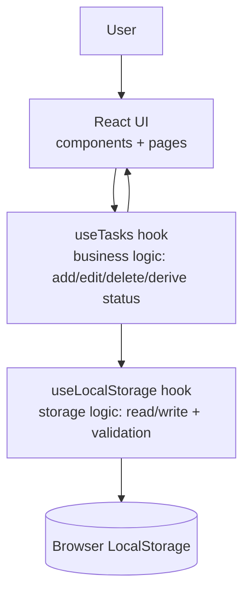

# Deadline Tracker

A clean, fast web app for tracking assignments, projects, exams, appointments, and other deadlines — so nothing quietly slips past due.

## Problem

Deadlines pile up across different contexts — coursework, personal errands, appointments — and it's easy to lose track of what's actually urgent versus what can wait. Calendar apps show *when* something is due but don't make *urgency* obvious at a glance, and most task apps require an account just to jot down a to-do.

## Solution

Deadline Tracker is a single-page app you can open and start using immediately, no sign-up required. You add a task with a deadline, and the app automatically figures out whether it's overdue, due today, due tomorrow, or upcoming — and shows it accordingly. A dashboard surfaces what needs attention first; a filterable list handles everything else.

## Features

- **Dashboard** with live counts (active, due today, due this week, overdue, completed) and tasks grouped into Overdue / Today / Upcoming / Completed sections.
- **Add / edit / delete tasks**, with a confirmation step before deleting.
- **Mark complete / incomplete** with one click.
- **Automatic deadline status** — overdue, due today, due tomorrow, upcoming — calculated from the current date/time rather than stored, so it's never stale.
- **Filtering and sorting**: by category, priority, completion state, and free-text search across title/description; sort by deadline or priority.
- **Responsive design** that works on desktop, tablet, and mobile.
- **Persistent storage** via the browser's LocalStorage — your data survives refreshes and browser restarts, with no backend.
- **Resilient to bad data** — corrupted or malformed LocalStorage content is detected and safely discarded instead of crashing the app.

## Tech stack

| Technology | Why |
|---|---|
| **React** | Component-based UI made sense for a dashboard with many repeated, stateful pieces (task cards, forms, filters). |
| **TypeScript** | Catches a large class of bugs (wrong field names, invalid status values) at compile time instead of at runtime — especially valuable for someone new to a dynamically-typed web stack. |
| **Vite** | Fast dev server and build tool with minimal configuration, standard for modern React projects. |
| **Tailwind CSS** | Utility classes let me build a consistent design system (spacing, color, type) directly in components, without maintaining separate CSS files per component. |
| **React Router** | Used for exactly two routes (Dashboard, All Tasks) so each has its own URL and can be linked to directly — not used for anything more complex than that. |
| **LocalStorage** | The app has no server. LocalStorage is sufficient for single-device, single-user persistence and keeps the project genuinely free to run and deploy. |

No global state management library (Redux, Zustand, etc.) is used — the app's state is small enough that a single custom hook (`useTasks`) plus React's built-in `useState` is simpler and easier to reason about.

## Architecture

The app is a static single-page app: everything runs in the browser, and persistence happens in LocalStorage. There is no backend and no database in this version.



**Layering, and why it's split this way:**

- **`utils/deadline.ts`** — pure functions that turn `(deadlineDate, deadlineTime, completed)` into a status (`overdue`, `today`, `tomorrow`, `upcoming`, `completed`). Status is **derived**, never stored, so it can't go stale — a task doesn't need to be "updated" at midnight for its status to become accurate; it's just recalculated on the next render.
- **`utils/validation.ts`** — form validation and a runtime type guard (`isTaskArray`) that checks data coming out of LocalStorage actually looks like `Task[]` before trusting it.
- **`hooks/useLocalStorage.ts`** — a generic, reusable hook that syncs any piece of state with a LocalStorage key, with error handling for corrupted or unavailable storage.
- **`hooks/useTasks.ts`** — the business-logic layer: owns the task list, exposes `addTask` / `updateTask` / `deleteTask` / `toggleComplete`, and computes derived data (dashboard stats, grouped sections) with `useMemo`.
- **`components/`** — presentation only. Components receive data and callbacks as props; they don't know about LocalStorage or business rules.
- **`pages/`** — compose components into full views (`Dashboard`, `AllTasks`).

## Installation

Requires [Node.js](https://nodejs.org/) 18 or later.

```bash
git clone <your-repo-url>
cd deadline-tracker
npm install
npm run dev
```

Then open the local URL Vite prints (usually `http://localhost:5173`).

Other useful scripts:

```bash
npm run build     # type-check and produce a production build in dist/
npm run preview   # locally preview the production build
npm run lint       # run static analysis (oxlint)
```

### Turning off sample data

On first run, the app seeds itself with a few example tasks so the UI isn't empty (see `src/data/sampleTasks.ts`). To start with a clean slate, either:

- Set `USE_SAMPLE_DATA = false` in `src/data/sampleTasks.ts`, or
- Clear the `deadline-tracker:tasks` key from your browser's LocalStorage (DevTools → Application → Local Storage).

Sample data is only ever used the *first* time the app runs with no existing data — it won't overwrite tasks you've already added.

## Deployment (Vercel)

1. Push this project to a GitHub repository.
2. Go to [vercel.com](https://vercel.com), sign in, and click **Add New → Project**.
3. Import the GitHub repository.
4. Vercel auto-detects the Vite framework preset — build command `npm run build`, output directory `dist`. Leave these as-is.
5. Click **Deploy**.

Every subsequent push to the main branch redeploys automatically.

## Project structure

```
src/
  components/   Presentational, reusable UI pieces (TaskCard, StatusBadge, modals, etc.)
  pages/        Top-level views composed from components (Dashboard, AllTasks)
  hooks/        useLocalStorage (generic persistence) and useTasks (task business logic)
  utils/        Pure functions: deadline math, form validation, filtering/sorting
  types/        Shared TypeScript types (Task, TaskFilters, etc.)
  data/         Sample/demo data, easy to disable
  App.tsx       Routes pages, owns modal/dialog open state
  main.tsx      App entry point, sets up React Router
```

## Future improvements

These are intentionally **not** implemented in this version, to keep the app honest about what it does today:

- Google Calendar sync (import/export deadlines)
- Notifications and reminders (browser push or email)
- User accounts and multi-device sync
- A real backend and database, so data isn't tied to one browser
- AI-assisted deadline extraction from pasted text (e.g. a syllabus)
- A companion Android app
- Notification-listener integration for auto-capturing deadlines from other apps
